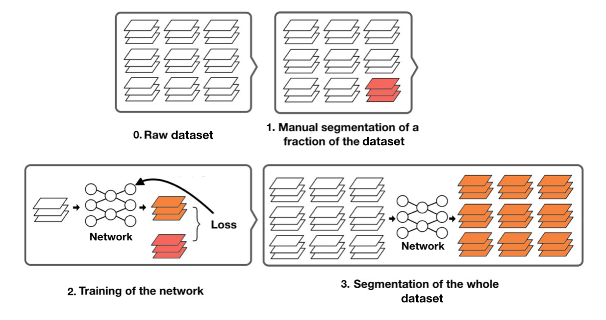

# Multiclass segmentaion pipeline

<h4 style="color:red"> Still under development </h4>

# About

This repo contains a pipeline to train networks for automatic multiclass segmentation of MRIs (NifTi files).
It is intended to segment homogeneous databases from a small amount of manual examples. In a typical scenario, the user segments manually 5 to 10 percents of his images, trains the network on these examples, and then uses the network to segment the remaining images. 

# Requirements

The pipeline uses Python 2.7. A decent amount of RAM (at least 8GB) is necessary to load the data during training. Although the training can be done on the CPU, it is sensibly more efficient on a GPU (with cuda librairies installed).

# Installation

Clone the repo: 

``` bash
git clone https://github.com/neuropoly/multiclass-segmentation
cd multiclass-segmentation
```

The required librairies can be easily installed with pip:

``` bash
pip install -r requirements.txt
```

# Data specifications

The pipeline can handle only <b>NifTi</b> (https://nifti.nimh.nih.gov/) images. The images used must share the same resolution and orientation for the network to work properly.
The examples of segmentations (ground truths, GT) to use for training must be binary masks, i.e. NifTi files with only 0 and 1 as voxel values. A GT file must correspond to a raw file and share its dimensions. If multiple classes are defined, a GT file must be generated for each class, and the GT masks must be exclusive (i.e. if a voxel has the value of 1 for one class, it must be 0 for the others).

# How to use

0. Description of the process

This pipeline's purpose is to train a neural network to segment NifTi files from examples.  
Since the training requires example, the first step consists in producing manual segmentations of a fraction of the files. 5 to 10% of the files should be a good proportion, however this sample must be representative of the rest of the dataset. Datasets with great variability might require bigger fractions to be manually segmented.  
The network is trained through a gradient back-propagation algorithm on the loss. The loss quantifies the difference between the predictions of the network and the manual segementations.  
Once trained, the network can be used to automtically segment the entire dataset.



1. Register the paths to your data


# Description of the files

- The **training.py** file implements the training process, generating the datasets, the network and defining the loop used to train the network.

- The **dataset.py** file contains classes used to create datasets that inherit the Pytorch dataset class and thus can be used to make dataloader objects. 
They are initialized with txt files containing the paths to the nifti files for the inputs and the ground truths. The data is stored as numpy arrays but returned as torch tensors. They can be provided with transformations for data augmentation. 
All files used for training (and validation) must share the same orientation, resolution and pixel/voxel sizes.

- The **transfroms.py** file contains classes used to create transformations that can be provided to a dataset for data augmentation. The transformations are functions that take as argument and return PIL images. 

- The **models.py** file contains classes that implement network architectures.

- The **segment.py** file contains a function to segment a nifti file with a trained model.

- The **losses.py** file contains calsses that implement different loss functions adapted to segmentation problems.

- The **metrics.py** file contains functions that compute different metrics to monitor the results of the model. 

- The **monitoring** file contains functions to write metrics and images to the tensorboard dashboard.

The files use paths for the paramaters json file and the txt files containing the paths to the input and ground truth nifti files. These paths are defined in the **paths.py** file. Examples of such parameters json file and txt input files are provided as **parameters.json**, **training_data.txt** and **validation_data.txt**. 
